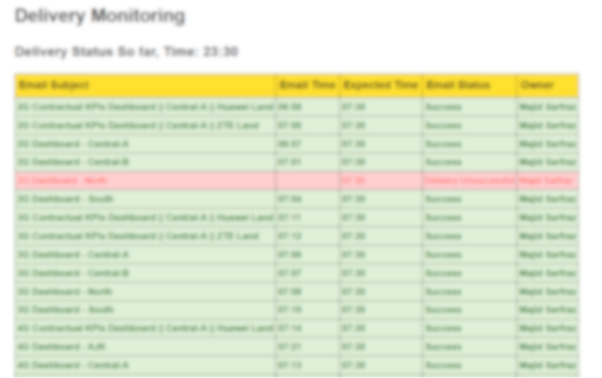

# Delivery Monitoring with EricMon



## Overview

This Python script, `delivery_check.py`, is designed for monitoring daily deliveries through the Outlook Sent Items folder. It retrieves delivery information from an EricMon database and matches it with emails in the Sent Items folder to track the status of deliveries. The script generates an HTML report and sends it via email to relevant stakeholders.

## Key Features:
- <b>Automated Monitoring</b>: The system automatically tracks delivery emails in the Outlook Sent Items folder.
- <b>Database Integration</b>: Desired emails to be monitored are stored in a database (SQL Server). The project connects to the database to retrieve delivery information.
- <b>Real-time Status Updates</b>: It provides real-time status updates on deliveries, including successful deliveries, late deliveries, and pending deliveries.
- <b>Customized Email Notifications</b>: The system generates detailed HTML email notifications with tables, highlighting critical delivery information.
- <b>User-Friendly Interface</b>: The email notifications are user-friendly, making it easy for recipients to understand the delivery status.
- <b>Customizable Styles</b>: The project includes a CSS file for customizing the appearance of email notifications.

## How It Works
1. The desired emails that need to be monitored are stored in a SQL Server database (EricMon).
2. The project connects to the database to retrieve delivery information, including expected delivery times and recipients.
3. It automatically tracks delivery-related emails in the Outlook Sent Items folder.
4. The system compares the received emails with the database records to determine the delivery status.
5. It generates HTML email notifications with tables, providing a clear overview of delivery statuses.
6. The notifications are sent via Outlook, ensuring timely communication with stakeholders.

## Prerequisites

Before using this script, ensure you have the following prerequisites:

- Python 3.x installed on your system.
- The `pywin32` library to work with Windows-specific features.
- Access to an Outlook email account.
- Make a database: "any-name" (in my case its EricMon), make a table: Meta_Delivery, then add your email entries into it.
- Proper configuration of the Outlook email account and database credentials in the script.

## Usage

1. Clone this repository to your local machine.

2. Install the required dependencies using pip:

```
pip install -r requirements.txt
```
## Run the script:
```
python delivery_check.py
```

## CSS Styling
The HTML report is styled using the EricMon.css file, which defines the appearance of the report's table, headers, and row colors. You can customize the styling by modifying this CSS file.

## Conclusion
The Delivery Monitoring with EricMon script simplifies the management of delivery tracking by automating the process of matching delivery records with sent emails. It ensures that stakeholders are informed of delivery statuses in real-time, enhancing efficiency and reducing manual tracking efforts.